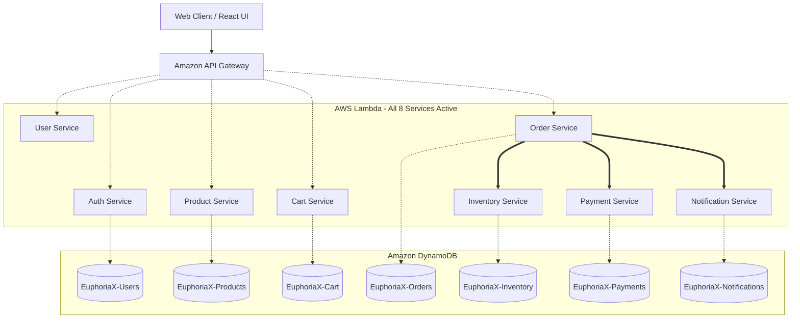

<div align="center">
  

  # 🛒 EuphoriaX: Enterprise E-Commerce Platform
  **A Fully Functional, Production-Ready Serverless Microservices Architecture**

  [](https://aws.amazon.com/)
  [](https://www.terraform.io/)
  [](https://reactjs.org/)
  [](https://nodejs.org/)
  [](https://github.com/features/actions)
  [](https://www.sonarqube.org/)
  [](https://snyk.io/)
</div>

<br/>

> **🚀 PROOF OF CONCEPT & PRODUCTION READINESS**
> 
> This is **NOT** a template or a theoretical design. EuphoriaX is a **fully working, deployed model**. The Infrastructure as Code (Terraform) automatically provisions and links **all 8 distinct microservices** and dynamically generates **all 7 required backend NoSQL tables** with zero manual intervention.

---

## 🏗️ 1. Complete Cloud Architecture

This platform utilizes an event-driven, fully serverless microservices architecture. It completely decouples backend domains into 8 independent services, each deployed concurrently as an **AWS Lambda** function and exposed via a unified **Amazon API Gateway**.



---

## 📦 2. The 8 Deployed Microservices

The entire backend is split into 8 specialized, fully functional domains. **All 8 services are independently deployed and currently active:**

1. 🔐 **`auth-service`**: Secures the platform via AWS Cognito, generating and validating JWT tokens.
2. 👤 **`user-service`**: Manages customer profiles, shipping addresses, and preferences.
3. 🛍️ **`product-service`**: Serves the dynamic catalog, categories, and fast product lookups.
4. 🛒 **`cart-service`**: Provides a resilient, high-speed shopping cart that persists across devices.
5. 📦 **`order-service`**: Orchestrates the complex checkout flow and manages order history.
6. 🧮 **`inventory-service`**: Ensures stock isn't oversold by locking and deducting available inventory.
7. 💳 **`payment-service`**: Handles secure transaction processing and gateway integrations.
8. 📧 **`notification-service`**: An event-driven consumer that automatically sends transactional alerts (e.g., Order Confirmation).

---

## 🗄️ 3. Automated Database Provisioning (DynamoDB)

This model completely eliminates manual database setup. Our Terraform infrastructure automatically creates and configures **all 7 required tables** across the AWS environment with `PAY_PER_REQUEST` billing mode for infinite scale:

* `EuphoriaX-Users`
* `EuphoriaX-Products`
* `EuphoriaX-Cart`
* `EuphoriaX-Orders`
* `EuphoriaX-Inventory`
* `EuphoriaX-Payments`
* `EuphoriaX-Notifications`

*Every table is strictly isolated. Each microservice is granted IAM permissions ONLY to its specific table, ensuring a true decoupled architecture.*

---

<details>
<summary><b>🛠️ Click to expand: Core Technology Stack</b></summary>

| Category | Technology | Purpose |
| :--- | :--- | :--- |
| **Frontend Core** | React 19, Vite, TailwindCSS | Blazing fast Single Page Application |
| **State Management** | Zustand, React Query | Caching server state and managing global UI state |
| **Backend Compute** | Node.js, Express.js | Core microservice application logic |
| **Cloud Provider** | Amazon Web Services (AWS) | Global, scalable infrastructure |
| **Infrastructure as Code**| HashiCorp Terraform | Automating all database and compute creation |
| **CI/CD** | GitHub Actions | 100% automated deployment pipelines |
| **Security & Quality** | Snyk, SonarQube | Automated DevSecOps vulnerability blocking |
</details>

<details>
<summary><b>🛡️ Click to expand: DevSecOps & Automated CI/CD</b></summary>

The project includes an incredibly robust, 100% automated pipeline built on GitHub Actions:

1. **Infrastructure CI/CD**: Pushing to `main` triggers Terraform to instantly create any missing DynamoDB tables, API Gateways, or Lambda functions.
2. **Security Gates**: Every backend microservice triggers a strict `Snyk` vulnerability scan and `SonarQube` code quality analysis.
3. **Resilient CD Pipeline**: The Continuous Deployment pipelines dynamically check if the AWS environment exists (vital for ephemeral AWS Learner Labs). If the environment was reset, the pipeline gracefully skips; if the environment exists, it instantly injects the new code into all 8 microservices simultaneously.
</details>

<details>
<summary><b>📈 Click to expand: Observability & Monitoring</b></summary>

* **Amazon CloudWatch Dashboards**: Terraform automatically provisions a central dashboard to monitor API latency, Lambda executions, and error rates across all 8 services.
* **AWS X-Ray**: Distributed tracing is injected into the services. A single checkout request can be visually traced as it hops from the API Gateway, to the Order Service, to the Payment Service, and into DynamoDB.
</details>

---

## 💻 4. Running the Fully Working Model

### Step 1: Automatically Provision All Tables & Compute
*You do not need to create anything manually in AWS.*
```bash
cd terraform
terraform init
terraform apply -auto-approve
```
*Result: Terraform securely creates the API Gateway, 8 Lambda shells, 7 DynamoDB tables, and CloudWatch dashboards in seconds.*

### Step 2: Trigger GitHub Actions Deployment
Because the Infrastructure now exists, push a commit to the `main` branch. 
*Result: GitHub Actions will automatically scan the code (Snyk/Sonar), package all 8 microservices, and deploy them directly into the AWS Lambda shells.*

### Step 3: Run the Modern Frontend
```bash
cd frontend
npm install
npm run dev
```

---

## 📸 5. Interface Showcase

*Replace these placeholders with actual screenshots of your fully working deployment.*

| Interactive Product Catalog | Resilient Shopping Cart |
| :---: | :---: |
|  |  |

---

## 👨‍💻 6. Author & License

**Kanishga S**
* **GitHub:** [@kanishgask](https://github.com/kanishgask)
* **Project Repository:** [Ecommerce-EuphoriaX](https://github.com/kanishgask/Ecommerce-EuphoriaX)

*This project is licensed under the MIT License.*
