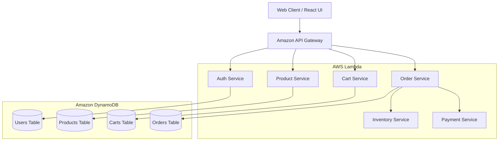

<div align="center">
  

  # 🛒 EuphoriaX: Enterprise E-Commerce Platform

  **A Highly Scalable, Serverless Microservices E-Commerce Architecture deployed on AWS.**

  [](LICENSE)
  [](https://aws.amazon.com/)
  [](https://www.terraform.io/)
  [](https://reactjs.org/)
  [](https://nodejs.org/)
  [](https://github.com/features/actions)
  [](https://www.sonarqube.org/)
  [](https://snyk.io/)
</div>

---

## 📖 1. Project Title and Professional Overview

**EuphoriaX** is a cutting-edge, enterprise-grade e-commerce application designed to handle high-traffic workloads. Built on a robust **Serverless Microservices Architecture**, the platform leverages AWS native services to ensure infinite scalability, maximum high availability, and optimal cost-efficiency. 

This project demonstrates advanced cloud-native engineering principles, integrating full-cycle DevOps methodologies, stringent security practices (DevSecOps), Infrastructure as Code (IaC), and comprehensive observability.

---

## 🏛️ 2. Architecture Overview

EuphoriaX utilizes an event-driven, serverless microservices architecture. The backend is decoupled into independent domains (Auth, Product, Order, Cart, etc.), each deployed as an **AWS Lambda** function and exposed via **Amazon API Gateway**. Data persistence is managed via highly performant NoSQL tables using **Amazon DynamoDB**.

The frontend is a blazing-fast Single Page Application (SPA) built with **React** and **Vite**, offering a dynamic, state-of-the-art user experience.

---

## 🎯 3. Business Problem

Traditional monolithic e-commerce platforms struggle with:
- **Scaling Bottlenecks:** Spikes in traffic during sales events cause system-wide crashes.
- **Slow Feature Rollouts:** Tightly coupled codebases make isolated deployments risky and slow.
- **High Operational Costs:** Paying for idle server compute during off-peak hours.
- **Poor User Experience:** Sluggish UI and slow checkout processes lead to cart abandonment.

---

## 💡 4. Solution Overview

EuphoriaX solves these issues by:
- **Serverless Compute:** AWS Lambda automatically scales from zero to tens of thousands of concurrent requests instantly. You only pay for exact compute time.
- **Microservices:** Independent services allow autonomous teams to develop, test, and deploy features without affecting the rest of the system.
- **Optimized UI:** A modern React/Vite frontend guarantees sub-second page loads and fluid interactions.

---

## 🛠️ 5. Technology Stack

| Category | Technology |
| :--- | :--- |
| **Frontend Core** | React 19, Vite, TailwindCSS |
| **State & Data Fetching** | Zustand, React Query |
| **Backend Compute** | Node.js, Express.js, Serverless HTTP |
| **Cloud Provider** | Amazon Web Services (AWS) |
| **Infrastructure as Code** | HashiCorp Terraform |
| **CI/CD & Automation** | GitHub Actions |
| **Security & Quality** | Snyk, SonarQube |
| **Auth & Security** | AWS Cognito, JWT, Helmet |

---

## ✨ 6. Project Features

* 🔐 **Secure Authentication:** Passwordless/MFA capabilities backed by AWS Cognito.
* 📦 **Dynamic Product Catalog:** Real-time inventory syncing and lightning-fast search.
* 🛒 **Resilient Shopping Cart:** Persisted carts across devices.
* 💳 **Secure Payment Processing:** Isolated payment microservice.
* 📊 **Admin Dashboard:** Visual analytics using Recharts.
* 🚀 **Serverless:** Zero server maintenance.

---

## 🧩 7. Microservices Overview

The backend is composed of the following decoupled services located in `/backend`:

* `auth-service`: Manages user registration, login, and token generation via Cognito.
* `product-service`: Handles product listings, details, and catalog management.
* `cart-service`: Manages user shopping carts.
* `order-service`: Processes checkouts and tracks order history.
* `inventory-service`: Manages stock levels and deductions.
* `payment-service`: Integrates with payment gateways for secure transactions.
* `user-service`: Manages user profiles and preferences.
* `notification-service`: Triggers transactional emails/SMS (Consumers).

---

## ☁️ 8. AWS Services Used

* **AWS Lambda:** Provides serverless compute for all microservices.
* **Amazon API Gateway:** Acts as the single entry point, routing HTTP requests to the appropriate Lambda functions.
* **Amazon DynamoDB:** A fully managed NoSQL database providing single-digit millisecond performance for Products, Orders, and Users.
* **Amazon Cognito:** Secures the platform with robust identity and access management.
* **Amazon CloudWatch:** Centralized logging, metrics, and alarming.
* **AWS X-Ray:** Provides end-to-end distributed tracing across microservices to identify performance bottlenecks.

---

## 🗺️ 9. System Architecture Diagram



---

## 📁 10. Project Folder Structure

```text
Euphoria-Final/
├── backend/                  # Node.js Microservices
│   ├── auth-service/         
│   ├── cart-service/         
│   ├── inventory-service/    
│   ├── order-service/        
│   └── product-service/      
├── frontend/                 # React SPA (Vite + Tailwind)
│   ├── src/                  
│   ├── package.json          
│   └── vite.config.js        
├── terraform/                # Infrastructure as Code
│   ├── api_gateway.tf        
│   ├── cloudwatch.tf         
│   ├── dynamodb.tf           
│   └── lambdas.tf            
└── .github/workflows/        # CI/CD Pipelines
    ├── frontend.yml
    ├── terraform.yml
    ├── reusable-backend-ci.yml
    └── deploy-*.yml
```

---

## 🏗️ 11. Infrastructure as Code (Terraform)

All AWS infrastructure is provisioned programmatically using **Terraform**, ensuring the environment is reproducible, version-controlled, and self-documenting.

* **`lambdas.tf`**: Provisions the serverless compute functions.
* **`api_gateway.tf`**: Configures REST API endpoints and routes.
* **`dynamodb.tf`**: Defines NoSQL schemas and read/write capacities.
* **`cloudwatch.tf`**: Sets up custom monitoring dashboards and alert alarms.

**To deploy infrastructure:**
```bash
cd terraform
terraform init
terraform apply -auto-approve
```

---

## 🔄 12. CI/CD Pipeline Workflow

EuphoriaX utilizes **GitHub Actions** for an automated, zero-downtime Continuous Integration and Continuous Deployment (CI/CD) pipeline.

1. **Commit & Push**: Developer pushes code to `main` or `ci-cd` branch.
2. **Terraform Auto-Apply**: The `terraform.yml` workflow automatically provisions any new cloud infrastructure requirements.
3. **Continuous Integration**: The `reusable-backend-ci.yml` pipeline triggers:
   - Dependency installation
   - Static Code Analysis (SonarQube)
   - Vulnerability Scanning (Snyk)
4. **Resilient Deployment**: The deployment workflows gracefully check if the AWS Learner Lab is active. If active, it zips and deploys the Node.js code to AWS Lambda.

---

## 🛡️ 13. DevSecOps Integration

Security and Code Quality are shifted left and integrated directly into the CI pipeline:

* **GitHub Actions**: Orchestrates the entire automated workflow.
* **SonarQube**: Scans the codebase for bugs, code smells, and technical debt, enforcing strict quality gates.
* **Snyk**: Continuously audits `package.json` dependencies for known CVEs and vulnerabilities.

---

## 📈 14. Observability & Monitoring

* **Amazon CloudWatch Dashboard**: Custom Terraform-provisioned dashboards track API latency, Lambda invocation counts, and error rates.
* **CloudWatch Alarms**: Configured to trigger alerts (via SNS) if error rates exceed thresholds or API latency spikes.
* **AWS X-Ray**: Distributed tracing is enabled on all Lambdas to visually track requests as they hop between the API Gateway, multiple Microservices, and DynamoDB.

---

## 🗄️ 15. Database Design

EuphoriaX utilizes **Amazon DynamoDB** for a highly decoupled data persistence layer.
* **Single Table Design / Micro-Databases**: Each microservice interacts exclusively with its designated DynamoDB table, preventing tight coupling and ensuring autonomous scaling.
* **Partition Keys**: Optimized for uniform data distribution (e.g., `UserId` for Carts, `ProductId` for Products).

---

## 🔌 16. API Overview

The platform communicates via RESTful APIs managed by Amazon API Gateway.
* `POST /auth/login` - Authenticates user and returns JWT.
* `GET /products` - Retrieves catalog.
* `POST /cart/items` - Adds item to cart.
* `POST /orders/checkout` - Processes final order.

---

## 🔒 17. Security Features

* **Authentication**: AWS Cognito handles secure user pools, password hashing, and token vending.
* **Authorization**: API Gateway validates JWT tokens before forwarding requests to Lambdas.
* **Application Security**: Express applications utilize `helmet` for secure HTTP headers and `cors` for origin restriction.
* **Dependency Scanning**: Snyk prevents malicious packages from being deployed.

---

## 🚀 18. Scalability & High Availability

* **Compute:** AWS Lambda scales concurrently out-of-the-box. There are no servers to over-provision or under-utilize.
* **Storage:** DynamoDB scales automatically to handle read/write spikes.
* **Availability:** AWS naturally replicates Lambda and DynamoDB across multiple Availability Zones (AZs) to survive data center outages.

---

## ⚡ 19. Performance Optimization

* **Frontend**: Vite ensures lightning-fast HMR and optimized production bundles. React Query caches server state to minimize redundant API calls.
* **Backend**: Node.js Lambdas utilize connection reuse for DynamoDB, drastically reducing cold start latency.

---

## 🚢 20. Deployment Instructions

### Prerequisites
* AWS CLI configured
* Terraform installed
* Node.js v18+

### Steps
1. Clone the repository: `git clone https://github.com/kanishgask/Ecommerce-EuphoriaX.git`
2. Initialize Infrastructure:
   ```bash
   cd terraform
   terraform init
   terraform apply
   ```
3. The GitHub Actions pipeline will automatically deploy the microservices upon push.

---

## 💻 21. Local Development Setup

To run the frontend locally:
```bash
cd frontend
npm install
npm run dev
```

To run a microservice locally (e.g., Auth Service):
```bash
cd backend/auth-service
npm install
npm run dev
```

---

## 🔑 22. Environment Variables

Create a `.env` file in the frontend and microservice directories:
```env
VITE_API_BASE_URL=https://<api-id>.execute-api.<region>.amazonaws.com/prod
COGNITO_USER_POOL_ID=ap-southeast-1_XXXXX
COGNITO_CLIENT_ID=XXXXX
DYNAMODB_TABLE=euphoriax-products
```

---

## 📸 23. Screenshots

*Replace these placeholders with actual application screenshots.*

| Home Page | Product Details |
| :---: | :---: |
|  |  |

| Shopping Cart | Admin Analytics |
| :---: | :---: |
|  |  |

---

## 🔮 24. Future Enhancements

* Implement **Elasticsearch** for advanced fuzzy product searching.
* Integrate **Redis (ElastiCache)** for sub-millisecond caching of popular products.
* Add a **Recommendation Engine** using AWS Personalize.
* Implement **GraphQL (AWS AppSync)** to reduce over-fetching on mobile clients.

---

## 🚧 25. Challenges Faced and Solutions

* **AWS Learner Lab Ephemeral Environments:** Learner labs destroy infrastructure daily. 
  * **Solution:** Rewrote the GitHub Actions CD pipeline to intelligently check for the existence of Lambda functions prior to deployment, gracefully skipping if the environment was reset, and integrated `terraform apply` into the CI/CD pipeline for automated rebuilds.
* **CI/CD Secret Inheritance:** Reusable GitHub workflows dropped access to SonarQube/Snyk tokens.
  * **Solution:** Identified GitHub's scoped secret boundary and implemented `secrets: inherit` across all backend pipeline triggers.

---

## 🎓 26. Learning Outcomes

This project provided extensive hands-on experience in:
* Architecting complex, distributed Microservices.
* Writing modular Infrastructure as Code using Terraform.
* Building resilient CI/CD pipelines in GitHub Actions.
* Integrating advanced DevSecOps tools (SonarQube & Snyk).
* Implementing AWS Observability (CloudWatch & X-Ray).

---

## ⭐ 27. Project Highlights

* **100% Serverless:** Zero servers to manage.
* **Fully Automated DevOps:** Push to deploy with zero manual intervention.
* **Enterprise Security:** A+ Security ratings via continuous automated auditing.

---

## 🏁 28. Conclusion

EuphoriaX stands as a testament to modern software engineering practices. By strictly adhering to Cloud-Native architectures and DevSecOps principles, it proves capable of acting as a scalable, secure, and highly-performant backbone for enterprise e-commerce operations.

---

## 📄 29. License

This project is licensed under the MIT License - see the [LICENSE](LICENSE) file for details.

---

## 👨‍💻 30. Author Information

**Kanishga S**
* **GitHub:** [@kanishgask](https://github.com/kanishgask)
* **Project Repository:** [Ecommerce-EuphoriaX](https://github.com/kanishgask/Ecommerce-EuphoriaX)
