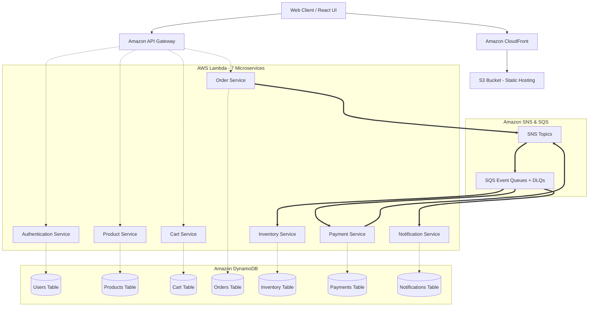

<div align="center">
 
  # 🛒 EuphoriaX: Enterprise Serverless E-Commerce Platform
  **A Fully Decoupled, Production-Ready Serverless Microservices Architecture**

  [](https://aws.amazon.com/)
  [](https://www.terraform.io/)
  [](https://reactjs.org/)
  [](https://nodejs.org/)
  [](https://github.com/features/actions)
  [](https://sonarcloud.io/)
  [](https://snyk.io/)
  [](https://jestjs.io/)
</div>

<div align="center">
  <h3>
    <a href="https://d3mjp5edb9pajn.cloudfront.net/">
      🔴 View Live Demo
    </a>
  </h3>
</div>

<br/>

> **🚀 ABOUT THIS PROJECT**
> 
> EuphoriaX is a fully operational, cloud-native e-commerce platform. It demonstrates a strict event-driven microservices architecture where domains are completely decoupled. The infrastructure is entirely managed by **Terraform**, CI/CD is fully automated via **GitHub Actions**, and the application scales infinitely using **AWS Serverless** technologies.

---

## 🏗️ 1. Complete Cloud Architecture

This platform utilizes an event-driven, fully serverless architecture. It decouples the backend domains into **7 independent services**, each deployed concurrently as an **AWS Lambda** function and exposed via a unified **Amazon API Gateway**.



---

## 📦 2. The 7 Microservices

The backend is split into 7 specialized, highly cohesive domains. Each service maintains its own repository pattern, error handling, logging, and 100% independent unit test suites.

1. 🔐 **`authentication-service`**: Secures the platform via AWS Cognito. Handles sign-up, login, password resets, and JWT token validation.
2. 🛍️ **`product-service`**: Serves the dynamic catalog and fast product lookups.
3. 🛒 **`cart-service`**: Provides a resilient, high-speed shopping cart tied to the user's Cognito session.
4. 📦 **`order-service`**: Orchestrates the complex checkout flow, stores order history, and publishes `OrderCreated` events to SNS.
5. 🧮 **`inventory-service`**: Consumes order events via SQS to ensure stock isn't oversold by locking and deducting available inventory.
6. 💳 **`payment-service`**: Consumes order events to handle transaction processing securely.
7. 📧 **`notification-service`**: An event-driven consumer that automatically sends transactional email alerts (e.g., Order Confirmations).

---

## 🗄️ 3. Infrastructure as Code (Terraform)

The `terraform_prod/` directory contains the complete IaC definition for the AWS environment. Running `terraform apply` automatically creates:

* **API Gateway**: A unified REST API with `{proxy+}` routing to all Lambdas.
* **DynamoDB Tables**: 7 isolated tables with `PAY_PER_REQUEST` billing and specialized Global Secondary Indexes (GSIs).
* **AWS Cognito**: User pool and web client configurations.
* **AWS Lambda**: 7 functions with least-privilege IAM execution roles (each service can only access its own specific database table).
* **Amazon SNS/SQS**: The event-driven messaging backbone including Dead Letter Queues (DLQs) for failed events.
* **CloudFront & S3**: Secure static hosting with Origin Access Control (OAC).

---

## 📊 4. Observability & Monitoring (CloudWatch)

This project heavily utilizes **Amazon CloudWatch** to provide complete visibility into the serverless architecture:

* **Centralized Dashboard**: Terraform automatically provisions a custom dashboard (`euphoriax-overview`) containing rich widgets that track Lambda Invocations, P99 Durations, API Gateway 4xx/5xx errors, and real-time SQS Queue depths.
* **Automated Alarms**: Pre-configured metric alarms instantly trigger if any Lambda function experiences >5 errors within 5 minutes, or if any Dead Letter Queue (DLQ) receives a failed event message.
* **Log Aggregation**: Every microservice and API Gateway route automatically streams execution logs to isolated CloudWatch Log Groups with a strict 14-day retention policy to optimize costs.

---

## 🛡️ 5. DevSecOps & Automated CI/CD

The project includes an incredibly robust, 100% automated pipeline built on **GitHub Actions**.

### Continuous Integration (CI)
Every push triggers the `reusable-backend-ci.yml` pipeline for the modified services.
1. **Dependency Installation**: Caches and installs NPM packages.
2. **Testing**: Runs the `Jest` test suite (the backend currently maintains over 100+ passing unit and integration tests).
3. **Security (Snyk)**: Performs automated DevSecOps vulnerability scanning on all open-source dependencies using Snyk to block critical CVEs from reaching production.
4. **Code Quality**: Pushes `lcov` coverage reports and static code analysis to SonarCloud.
5. **Build**: Zips the production-ready code as an artifact.

### Continuous Deployment (CD)
If the CI pipeline passes on the `main` branch, the deployment pipeline takes over:
1. **Lambda Deployment**: Dynamically updates the AWS Lambda function code using the AWS CLI.
2. **Frontend Deployment**: Builds the Vite React app, synchronizes it with the secure S3 bucket, and automatically invalidates the CloudFront cache.

---

## 🛠️ 6. Core Technology Stack

| Category | Technology | Purpose |
| :--- | :--- | :--- |
| **Frontend UI** | React 19, Vite, TailwindCSS | Blazing fast Single Page Application |
| **Backend Compute** | Node.js 20, Express.js | Core microservice application logic |
| **Databases** | Amazon DynamoDB | NoSQL persistence with single-digit ms latency |
| **Event Streaming** | Amazon SNS & SQS | Decoupled asynchronous messaging |
| **Security** | AWS Cognito | Identity and Access Management |
| **Infrastructure**| HashiCorp Terraform | Automating all AWS resource provisioning |
| **CI/CD** | GitHub Actions | 100% automated testing & deployment pipelines |
| **Code Quality** | Snyk, SonarCloud | Automated DevSecOps vulnerability & quality blocking |
| **Testing** | Jest, Supertest, Vitest | Backend & Frontend test frameworks |

---

## 💻 7. How to Deploy & Run

### Step 1: Clone the Repository
```bash
git clone https://github.com/kanishgask/AWS-Ecommerce-Project.git
cd AWS-Ecommerce-Project
```

### Step 2: Provision Infrastructure (Terraform)
You must have the AWS CLI installed and configured.
```bash
cd terraform_prod
terraform init
terraform apply -auto-approve
```
*Terraform will output your `api_gateway_url` and `cloudfront_distribution_id`.*

### Step 3: Trigger CI/CD
1. Go to your repository on GitHub.
2. Navigate to **Settings > Secrets and variables > Actions**.
3. Add your AWS credentials and Terraform outputs as secrets (`AWS_ACCESS_KEY_ID`, `AWS_SECRET_ACCESS_KEY`, `CLOUDFRONT_DISTRIBUTION_ID`).
4. Trigger the GitHub Actions workflow to build and deploy the Lambda code and React frontend.

### Step 4: Local Frontend Development
If you want to run the React app locally while pointing to the AWS backend:
```bash
cd frontend
npm install
# Create an environment file with the Terraform api_gateway_url output
echo "VITE_API_BASE_URL=<INSERT_API_GATEWAY_URL_HERE>" > .env
npm run dev
```
Visit `http://localhost:5173` in your browser.

---

## 👨‍💻 8. Author & License

**Kanishga S**
* **GitHub:** [@kanishgask](https://github.com/kanishgask/Ecommerce_EuphoriaX)

*This project is licensed under the MIT License.*
